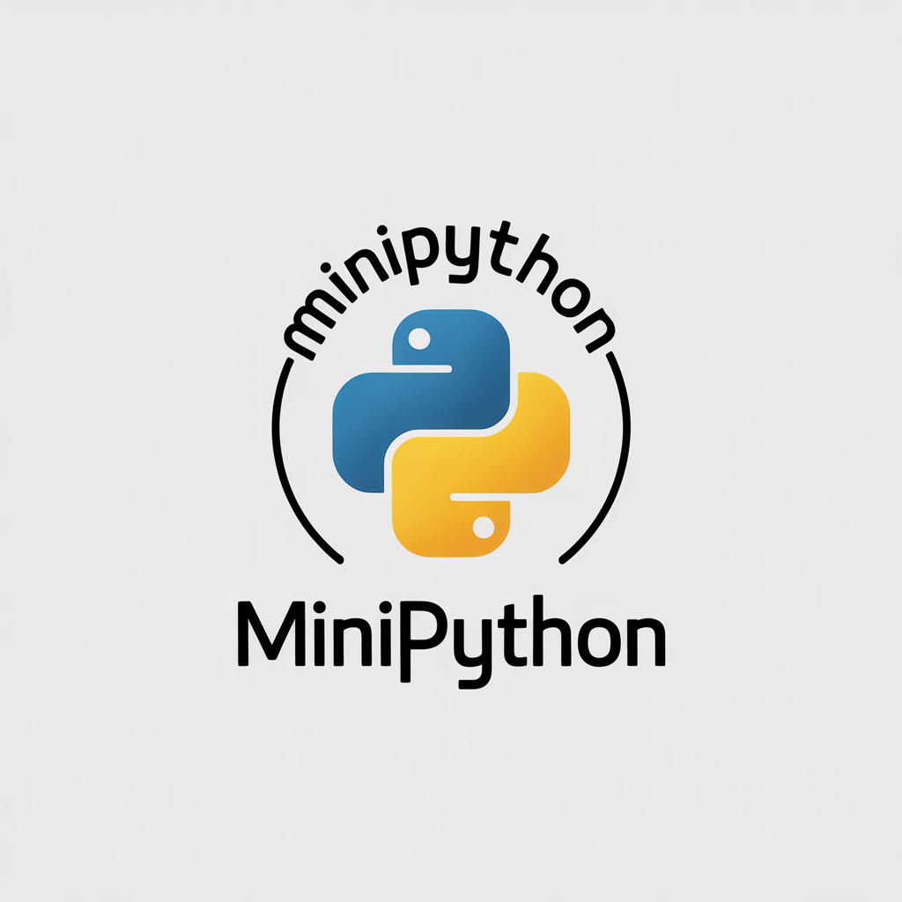

# MiniPython Project



## 📌 Description
Ce projet **MiniPython** est un programme développé dans le cadre d’un TP / projet académique. Il a pour objectif de mettre en pratique les bases de la programmation en Python : structures de contrôle, fonctions, manipulation des données et organisation d’un petit projet logiciel.

Le programme est simple à exécuter et ne nécessite que des outils standards.

---

## 🛠️ Technologies utilisées

- **Langage** : Python 3
- **Environnement** :
  - Windows / Linux / macOS
  - Terminal (CMD, PowerShell ou Bash)
- **Éditeur recommandé** :
  - VS Code
  - PyCharm (optionnel)

---

## ⚙️ Installation

### 1️⃣ Prérequis

- Python **3.x** installé sur votre machine

Pour vérifier l’installation de Python :
```bash
python --version
```
ou
```bash
python3 --version
```

---

### 2️⃣ Cloner ou récupérer le projet

```bash
git clone <url_du_depot>
cd minipython-project
```

Ou bien :
- Télécharger le dossier du projet
- Extraire le contenu

---

### 3️⃣ Lancer le programme

Dans le dossier du projet :

```bash
python prgPythonPur_fixed.py
```
*(Remplacez `prgPythonPur_fixed.py` par le nom réel du fichier principal si nécessaire)*

---

## ▶️ Utilisation

- Exécuter le programme depuis le terminal
- Suivre les instructions affichées à l’écran
- Les résultats s’affichent directement dans la console

---

## 🧠 Techniques utilisées

- Variables et types de données
- Conditions (`if / else`)
- Boucles (`for`, `while`)
- Fonctions
- Listes et dictionnaires
- Modularisation du code
- Lecture / affichage en console

---

## 📂 Structure du projet

project-root/
│
├── assets/ # Ressources du projet (images, fichiers auxiliaires)
│
├── exemple de test/ # Exemples de fichiers MiniPython pour les tests
│
├── main/ # Code source principal
│ ├── a.py # Lexer / analyse lexicale
│ ├── graphiz.py # Génération de graphes (AST, visualisation)
│ └── prgPythonPur_fixed.py# Parser et logique principale MiniPython
│
├── vizualizations/ # Résultats de visualisation
│ └── ast_pythonpur.dot # Graphe AST au format Graphviz
│
├── grammar.lark # Grammaire MiniPython (Lark)
├── readme.md # Documentation du projet
└── main.py # Point d’entrée du programme

---

## ✅ Exemple d’exécution

```text
=== MiniPython Project ===
1. Choisir une option
2. Entrer une valeur
```

---

## 👨‍💻 Auteur

- Nom : BALI MOHAMMED RYAD
- Formation : *4ème ING GL*
- Année : 2024 / 2025

---

## 📜 Licence

APACHE 2.0
